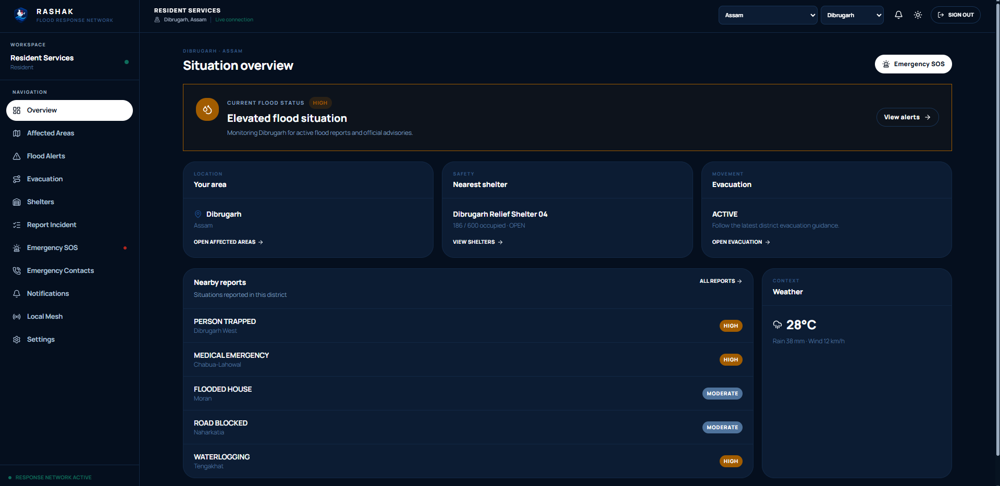
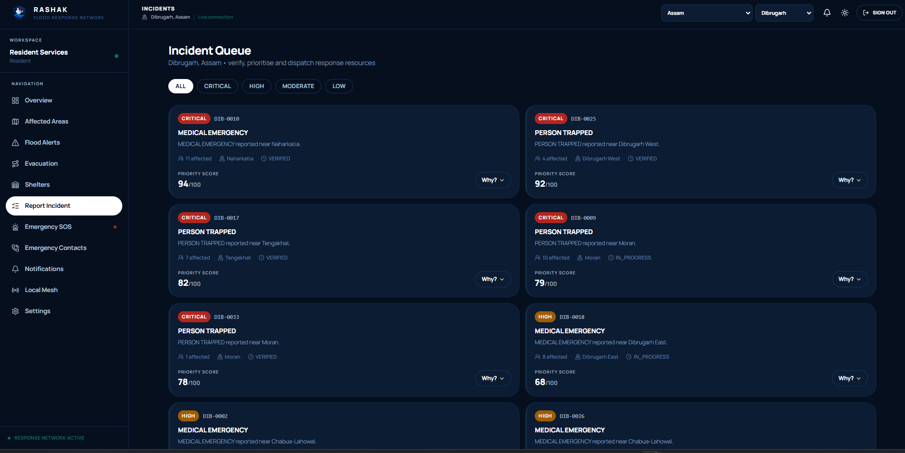
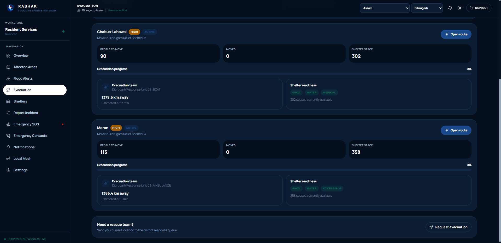
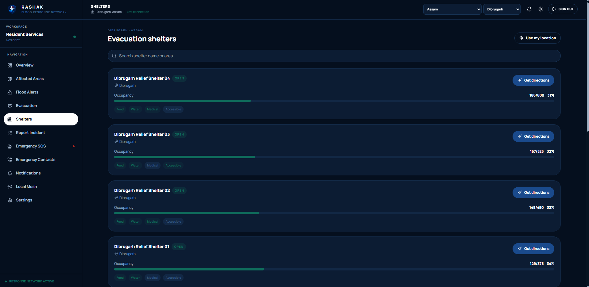
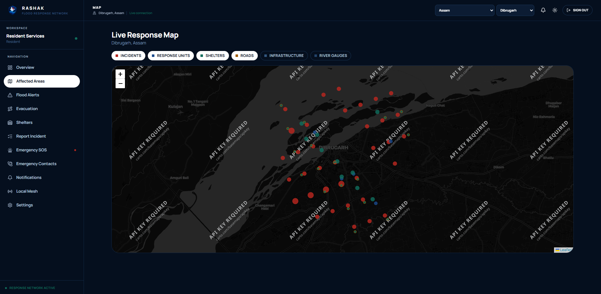
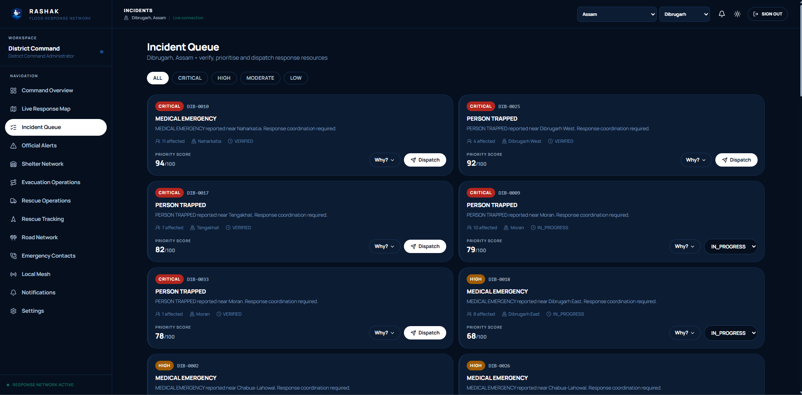
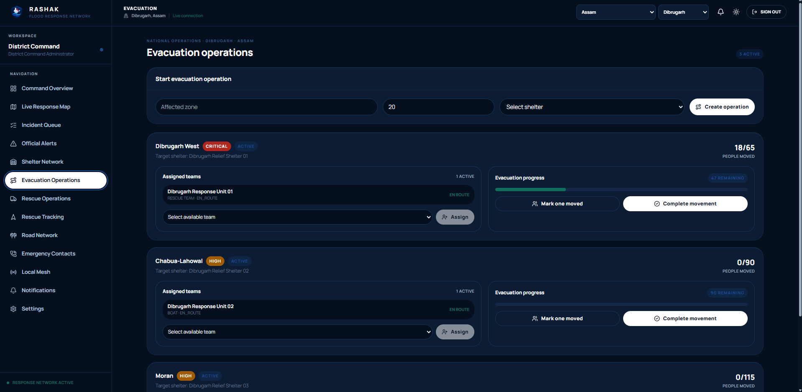
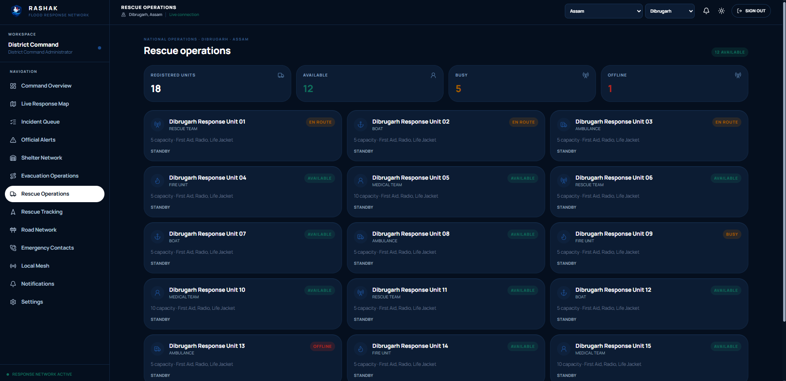
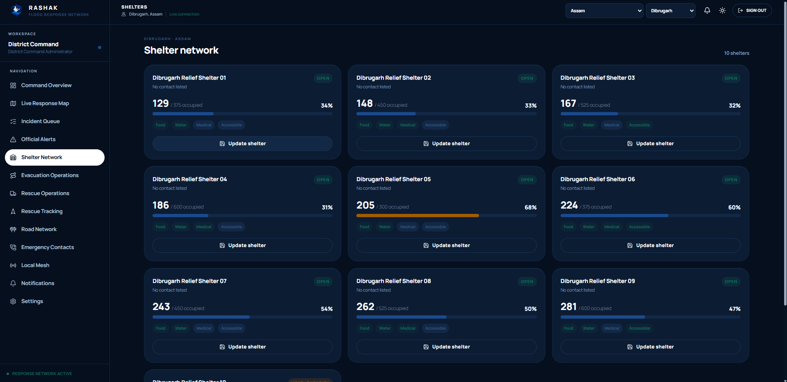

# Rashak

Rashak is a real time flood response and emergency coordination platform built for residents and district administrators. It connects public safety information with operational response tools so people can find help quickly while response teams can coordinate incidents, shelters, evacuations and rescue activity from one system.

## Problem statement

During flood emergencies, residents and district response teams work with fragmented, delayed and often unverified information. Residents struggle to find open shelters, current occupancy, safe evacuation routes and emergency contacts in real time, while relief SOS calls go through informal channels with no location context. District administrators lack a single operational view of incidents, shelter capacity, evacuation progress and rescue unit status, which slows verification, prioritization and dispatch during the exact window when speed matters most.

Rashak addresses this by giving residents a live, location aware view of flood conditions, shelters and evacuation support, and by giving administrators a unified command interface to verify incidents, prioritize response, assign rescue teams and track evacuation and shelter operations in real time, with fallback data so the system keeps working even when public data sources are degraded or unavailable.

## Screenshots

### Resident workspace

| Situation overview | Incident queue | Evacuation |
| --- | --- | --- |
|  |  |  |

| Shelters | Live response map |
| --- | --- |
|  |  |

### Administrator (district command) workspace

| Incident queue | Evacuation operations |
| --- | --- |
|  |  |

| Rescue operations | Shelter network |
| --- | --- |
|  |  |

## What Rashak does

Rashak has two focused experiences.

### Resident

Residents can:

1. View flood conditions, alerts and affected areas
2. Find nearby emergency shelters using their location
3. Check shelter occupancy and available resources
4. Call shelter or emergency contacts directly
5. Open evacuation routes in Google Maps
6. See the assigned response team and estimated distance when an evacuation request is active
7. Report incidents
8. Send an SOS with live location
9. Receive nearby SOS notifications from other people using the platform
10. View notifications, official alerts, weather and local emergency information

### Administrator

Administrators can:

1. Monitor districts, incidents and flood conditions
2. Review incoming resident reports
3. Manage shelters and update occupancy
4. Update shelter food, water and essential resource availability
5. Create and manage evacuation operations
6. Assign response teams to evacuation requests
7. Track active rescue and evacuation operations
8. Monitor responder location and operation progress
9. Review road and route conditions
10. Manage emergency contacts and operational information

## Core workflow

```text
Public data and operator updates
          ↓
   Backend normalization
          ↓
 MongoDB cache and fallback data
          ↓
 REST API + Socket.IO
          ↓
 ┌───────────────────────┐
 │ Resident experience   │
 │ Admin experience      │
 └───────────────────────┘
```

A resident can report an emergency or request evacuation support. The backend creates the operational record and broadcasts relevant updates through Socket.IO. Administrators can assign a response team, monitor progress and close the operation when the response is complete.

For an SOS request, the platform uses the resident's live location and notifies nearby active users in the app so people in the surrounding area can be made aware of the emergency.

## Main features

### Emergency response

• Live flood and incident monitoring
• Resident incident reporting
• Location based SOS
• Nearby SOS notifications
• Emergency contacts
• Real time Socket.IO updates

### Shelter operations

• Nearby shelter discovery
• Location based sorting
• Occupancy tracking
• Capacity status
• Food and water availability
• Shelter contact and navigation actions

### Evacuation and rescue

• Resident evacuation requests
• Google Maps route opening
• Response team distance and ETA visibility
• Admin team assignment
• Rescue operation tracking
• Operation status updates
• Road and route monitoring

### Maps and location

• Leaflet operational maps
• OpenStreetMap basemap
• Browser geolocation
• Google Maps navigation links
• OSRM routing with fallback distance calculations

### Data reliability

Rashak is designed so the operational interface can continue working when public data sources are unavailable.

```text
External source
      ↓
Normalize
      ↓
MongoDB cache
      ↓
Operational API
      ↓
UI

If source fails
      ↓
Cached data
      ↓
Fallback operational data
```

Demo data is clearly treated as demo or fallback data and is not presented as official government data.

## Public data sources

Rashak includes adapters and integrations for selected public sources and services.

• SACHET and NDMA alert data when reachable
• Open Meteo weather data
• OpenStreetMap and Leaflet
• OSRM routing
• Assam public flood related source pages
• CWC related operational records through labelled cached or demo data
• Optional IMD district warning adapter when verified object IDs are configured

Public services can change, rate limit requests or become unavailable. Rashak therefore uses caching and fallback data instead of assuming that an external feed will always be available.

## Technology stack

### Frontend

• React
• Vite
• JavaScript
• CSS
• Leaflet
• Recharts

### Backend

• Node.js
• Express.js
• Socket.IO
• REST APIs
• JWT bearer authentication
• Express Rate Limit
• Helmet
• Mongo Sanitize
• HPP
• Express Validator

### Database

• MongoDB
• Mongoose

### External services

• OpenStreetMap
• OSRM
• Open Meteo
• SACHET and NDMA
• Optional IMD adapter
• Groq for server side AI assistance

### Deployment

• Vercel for the frontend
• Render for the backend

## Authentication

Rashak uses bearer token authentication.

```text
Role selection or login
        ↓
Signed JWT
        ↓
Authorization: Bearer <token>
        ↓
Protected API
```

There is no CSRF system in the current architecture and the API does not depend on cross origin authentication cookies.

For production, set a strong random `JWT_SECRET` and keep it only on the backend.

## Environment variables

### Backend

```env
PORT=5000
NODE_ENV=production
MONGO_URI=your_mongodb_uri
JWT_SECRET=your_long_random_secret
JWT_EXPIRES_IN=7d
GROQ_API_KEY=your_groq_key
GROQ_MODEL=openai/gpt-oss-120b
CLIENT_URL=https://your-frontend-domain.vercel.app
AUTO_INGEST=true
INGEST_CRON=*/15 * * * *
IMD_DISTRICT_IDS_JSON={}
DEMO_DATA_FALLBACK=true
DEMO_BYPASS_AUTH=false
```

`INGEST_INTERVAL_MS` is not required by the current server scheduler. The active cron based ingestion uses `INGEST_CRON`.

### Frontend

```env
VITE_API_URL=https://your-backend-domain.onrender.com/api
```

Never expose `JWT_SECRET`, `MONGO_URI` or `GROQ_API_KEY` in the frontend.

## Local setup

From the project root:

```bash
npm install
npm run install:all
npm run dev
```

Or run the services separately.

### Backend

```bash
cd backend
npm install
cp .env.example .env
npm run dev
```

### Frontend

```bash
cd frontend
npm install
cp .env.example .env
npm run dev
```

On Windows, use the equivalent file copy command for your shell.

## Project structure

```text
rashak-platform/
├── frontend/
│   ├── public/
│   └── src/
│       ├── components/
│       ├── context/
│       ├── data/
│       ├── i18n/
│       ├── lib/
│       └── pages/
│           └── dashboard/
│
├── backend/
│   ├── config/
│   ├── controllers/
│   ├── middleware/
│   ├── models/
│   ├── routes/
│   ├── services/
│   └── utils/
│
├── docs/
│   └── screenshots/
│
└── README.md
```

## AI support

Groq is used only from the backend for optional assistance such as:

• Situation summaries
• Emergency message generation
• Translation support
• Incident extraction
• SITREP generation

The application also provides deterministic fallback behaviour so a missing AI provider does not break the core emergency workflow.

## Security and reliability

Rashak includes:

• Bearer JWT authentication
• Role based authorization
• Rate limiting on auth endpoints
• Helmet security headers
• Input validation
• Mongo query sanitization
• HTTP parameter pollution protection
• Exact frontend origin control through CORS
• Server side secrets
• Fallback operational data
• Cached public data

## Repository

GitHub:
https://github.com/MakersNeedMore-MnM/Round2-ayush639498

## Deployment

Frontend:

Add the current Vercel deployment URL here.

Backend:

Add the current Render deployment URL here.

## Demo notes

The application supports a resident workflow and an administrator workflow so judges can see both sides of the emergency response process.

Recommended demonstration flow:

1. Enter as Resident
2. Find a nearby shelter and inspect occupancy and resources
3. Open an evacuation route
4. Send a test incident or SOS using live location
5. Open the Administrator workspace
6. Review the incident or SOS event
7. Assign a response team
8. Update shelter resources or occupancy
9. Track the rescue operation
10. Close the operation and verify the updated state

## Team members

| Name | Role |
| --- | --- |
| Ayush | Full stack development |
| _Add name_ | _Add role_ |
| _Add name_ | _Add role_ |

## Important limitations

Public government feeds and third party routing services may change availability or rate limits. The project therefore distinguishes official, cached, verified, community, operator, demo and simulation data where applicable.

IMD district warning integration intentionally requires verified current district object IDs. No IDs are guessed.

The SOS feature is an in app emergency awareness mechanism. It should not be treated as a replacement for official emergency services.
